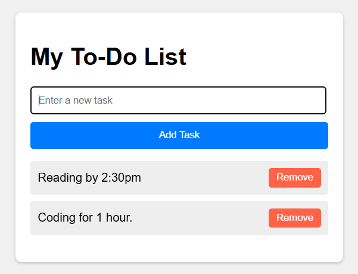

Simple To-Do List Application

A clean and straightforward to-do list application built with HTML, CSS, and vanilla JavaScript that saves your tasks in the browser.

✨ Features
This application allows users to:

Add New Tasks: Quickly add new items to the to-do list.
Delete Tasks: Remove tasks individually with a click of a button.
Persistent Storage: All tasks are saved to the browser's localStorage, so your list will be there even after you close the tab or restart your computer.

🛠️ Technologies Used
This project is built using fundamental front-end technologies, making it a great example of core web development skills.

HTML5: For the structure and content of the application.
CSS3: For styling the user interface to be clean and responsive.
Modern JavaScript (ES6+): For all the application logic, including:
DOM Manipulation (creating, adding, and deleting elements).
Event Listeners (click, keypress) for user interaction.
localStorage API for saving and retrieving data.
JSON.stringify() and JSON.parse() for data serialization.

💡 How It Works
The application's logic is handled entirely on the client-side with JavaScript:

LOADING: When the page loads, the script checks localStorage for any previously saved tasks. If found, it parses the JSON data and renders the list.

ADDING: When a user types a task and clicks "Add Task" or presses 'Enter', the new task is added to a JavaScript array, the list is re-rendered on the screen, and the entire updated array is saved to localStorage.

DELETING: Each task is rendered with a "Remove" button. When clicked, the button uses its array index to remove the corresponding task from the JavaScript array. The list is then re-rendered and the updated, shorter array is saved to localStorage.

👤 Contact
Abdulrazak Idris Yahaya - www.linkedin.com/in/abdulrazak-idris-yahaya

Project Link: https://github.com/alx-software-engineer/dynamic-to-do-list-js

🚀 Getting Started
To get a local copy up and running, follow these simple steps.

Prerequisites
All you need is a modern web browser like Google Chrome, Firefox, or Microsoft Edge.